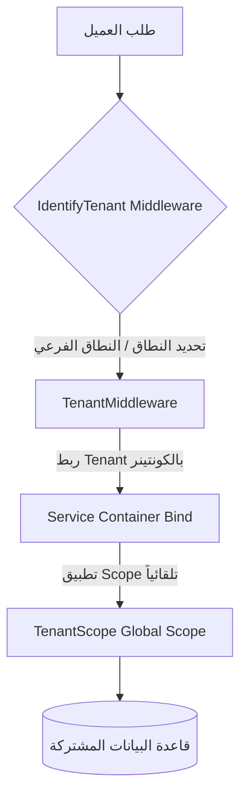
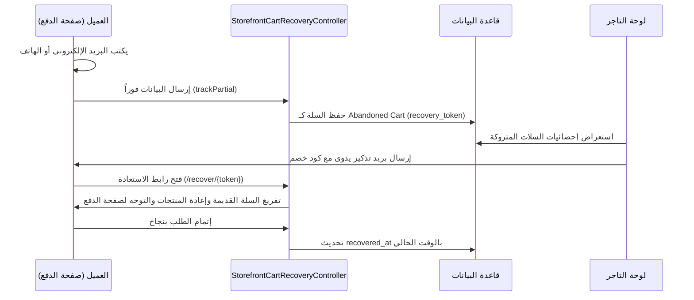

# دليل المطورين لنظام Order Saif (Developer Guide)

مرحباً بك في دليل المطورين لمنصة **Order Saif**، وهي منصة تجارة إلكترونية متعددة التجار (SaaS Multi-Tenant) مبنية باستخدام إطار العمل Laravel للباك إند، وInertia.js مع React 19 للفرونت إند الخاص بلوحة تحكم التجار، بالإضافة إلى صفحات Blade وAlpine.js لواجهة المتجر (Storefront).

---

## 1. معمارية النظام (System Architecture)

يعتمد النظام على بنية **Single Database Multi-Tenancy**، حيث تشترك جميع المتاجر (Tenants) في قاعدة بيانات واحدة، ويتم عزل البيانات برمجياً على مستوى الاستعلامات باستخدام حقل `tenant_id`.



### 1.1 معالجة وتحديد التاجر (Tenant Resolution)

تتم عملية تحديد المتجر الحالي عبر طلب الويب من خلال اثنين من الـ Middlewares الرئيسية:
1. **[IdentifyTenant](file:///e:/programing/flutter%20project/fast%20order/app/Http/Middleware/IdentifyTenant.php)**: 
   - يقوم بقراءة الـ Host الخاص بالطلب ومقارنته بالنطاقات المخصصة (`custom_domain`) في جدول `tenants`.
   - في حال عدم وجود مطابقة، يستخرج النطاق الفرعي (Subdomain) من النطاق الأساسي للمنصة (مثال: `merchant.OrderSaif.com` -> المتجر `merchant`).
   - يقوم بربط كائن المتجر الحالي بداخل الـ Service Container الخاص بـ Laravel كـ Singleton: `app()->instance(Tenant::class, $tenant)`.
   - يضبط إعدادات الكونفيج: `config(['tenant.id' => $tenant->id])` لتسهيل الوصول إليها.

2. **[TenantMiddleware](file:///e:/programing/flutter%20project/fast%20order/app/Http/Middleware/TenantMiddleware.php)**:
   - يتعامل مع مسارات الويب التي تحتوي على المعامل `{tenant}` في الرابط (Slug-based routing).
   - يقوم بحفظ معرف المتجر في الجلسة `session()->put('tenant_id', $tenant->id)` ويضبط المسار الافتراضي للروابط التابعة للمتجر لكي لا يضطر المطور لتمرير متغير المتجر يدوياً في كل رابط: `URL::defaults(['tenant' => $tenant->slug])`.

### 1.2 عزل البيانات في قاعدة البيانات (Data Isolation)

لعزل بيانات الجداول (المنتجات، الطلبات، الكوبونات، إلخ) بين التجار بشكل آمن ومضمون 100% دون نسيان الفلترة في الاستعلامات، نستخدم:
- **السمة (Trait) [BelongsToTenant](file:///e:/programing/flutter%20project/fast%20order/app/Traits/BelongsToTenant.php)**: 
  تُضاف هذه السمة إلى أي موديل (Model) يخص التاجر. عند بدء الموديل، تقوم تلقائياً بـ:
  1. إضافة الـ Global Scope المسمى `TenantScope`.
  2. تعبئة حقل `tenant_id` تلقائياً عند إنشاء سجل جديد بسحب القيمة من الجلسة أو الإعدادات العامة: `session()->get('tenant_id') ?? config('tenant.id')`.

- **الـ Scope العالمي [TenantScope](file:///e:/programing/flutter%20project/fast%20order/app/Scopes/TenantScope.php)**:
  يقوم بتعديل كافة استعلامات الاسترجاع (Select) للموديل لإضافة شرط `where tenant_id = {current_tenant_id}` تلقائياً وبشكل مخفي.

> [!IMPORTANT]
> عند كتابة استعلامات مخصصة أو استخدام SQL خام، تأكد دائماً من تضمين `tenant_id` يدوياً لضمان عدم تسريب البيانات بين المتاجر.

---

## 2. دليل التشغيل والتنصيب المحلي (Local Setup Guide)

لإعداد المشروع وتنسيقه على جهازك المحلي للتحسين والتطوير:

### 2.1 المتطلبات الأساسية
- **PHP** >= 8.2 (مع موديولات PDO, OpenSSL, Mbstring, XML, Ctype, BCMath).
- **Composer** لإدارة حزم PHP.
- **Node.js** (الإصدار 18 أو أحدث) مع **npm**.
- خادم قاعدة بيانات **MySQL** أو **MariaDB** (أو استخدام SQLite للتطوير السريع).

### 2.2 خطوات التشغيل

1. **تثبيت الاعتمادات للباك إند والفرونت إند:**
   ```bash
   composer install
   npm install
   ```

2. **إنشاء ملف الإعدادات البيئية (.env):**
   انسخ ملف `.env.example` إلى ملف `.env`:
   ```bash
   copy .env.example .env
   ```

3. **توليد مفتاح التطبيق:**
   ```bash
   php artisan key:generate
   ```

4. **إعداد قاعدة البيانات:**
   قم بإنشاء قاعدة بيانات فارغة بالاسم المحدد في ملف `.env` (مثال: `fast_order_prod` أو اسم مخصص محلي)، ثم قم بتشغيل التهجيرات (Migrations) مع البيانات التجريبية (Seeders):
   ```bash
   php artisan migrate --seed
   ```

5. **تهيئة النطاقات المحلية (Local Domains):**
   يدعم المشروع نظام النطاقات الفرعية. لتشغيل ذلك محلياً، يجب إضافة النطاقات إلى ملف الـ `hosts` في نظام التشغيل الخاص بك (المسار في ويندوز: `C:\Windows\System32\drivers\etc\hosts`):
   ```text
   127.0.0.1   OrderSaif.test
   127.0.0.1   merchant1.OrderSaif.test
   127.0.0.1   merchant2.OrderSaif.test
   ```
   *ملاحظة:* يوجد سكربت PowerShell جاهز في جذر المشروع باسم `setup-hosts.ps1` يمكن تشغيله كمسؤول لتنفيذ هذه الخطوة تلقائياً.

6. **إعداد الجلسات عبر النطاقات الفرعية (Wildcard Sessions):**
   تأكد من ضبط القيم التالية في ملف `.env` لكي تتمكن الجلسات من الانتقال بحرية بين النطاق الرئيسي والنطاقات الفرعية للتاجر:
   ```env
   APP_URL=http://OrderSaif.test
   SESSION_DOMAIN=.OrderSaif.test
   ```

7. **تشغيل سيرفر التطوير:**
   قم بتشغيل خادم Laravel وخادم Vite بالتوازي:
   - لتشغيل Laravel: `php artisan serve --host=OrderSaif.test --port=8000`
   - لتشغيل Vite: `npm run dev`

---

## 3. شرح الميزات المتقدمة (Advanced Features Blueprint)

### 3.1 نظام تتبع واستعادة السلات المتروكة (Abandoned Carts Recovery)

يهدف هذا النظام لتتبع وحفظ السلات التي يبدأ العملاء في تعبئتها لكنهم يغادرون قبل إتمام عملية الدفع والشراء.



#### المكونات والمسارات البرمجية:
1. **التتبع التلقائي الجزئي (`trackPartial`):**
   أثناء تواجد الزائر في صفحة الـ Checkout وكتابته لاسمه أو بريده أو هاتفه، يتم إرسال طلب POST خلفي إلى مسار API التتبع.
   - الكنترولر المسؤول: `StorefrontCartRecoveryController@trackPartial`
   - يتم تخزين السلة في جدول `abandoned_carts` مع حفظ محتويات السلة (المنتجات، الكميات، المجموع) بصيغة JSON في حقل `cart_data` وتوليد `recovery_token` فريد وتخزين الـ `session_id`.

2. **الاستعادة وإعادة التوجيه (`recover`):**
   عندما يضغط العميل على رابط التذكير الترويجي في بريده الإلكتروني بالصيغة: `http://{tenant}.OrderSaif.test/recover/{token}?coupon={discount_code}`
   - الكنترولر المسؤول: `StorefrontCartRecoveryController@recover`
   - يتم التحقق من صحة التوكن وعدم استخدام السلة سابقاً (`recovered_at` فارغ).
   - يتم استخدام `CartService` لتفريغ سلة العميل الحالية بالكامل، وإعادة بناء السلة من المنتجات المخزنة بداخل `cart_data`.
   - يتم تطبيق كوبون الخصم تلقائياً إن وجد في الرابط، وتوجيه المستخدم مباشرة لصفحة الدفع.

3. **تسجيل الاسترداد (Correlation):**
   عندما يقوم العميل بإرسال الطلب وإتمام الدفع بنجاح في `CheckoutController@store`:
   - يبحث الكنترولر عن السلات المتروكة النشطة المقترنة بـ (جلسة العميل، بريده الإلكتروني، أو هاتفه) ويقوم بتحديث حقل `recovered_at` إلى الوقت الحالي لمنع إرسال تذكيرات تكرارية لها لاحقاً وحسابها كعملية استرداد ناجحة في الإحصائيات.

---

### 3.2 نظام إدارة المرتجعات والمخازن (Returns & Inventory Control)

يتيح هذا النظام إدارة دورة حياة إرجاع المنتجات من العميل، وضبط المخزون بشكل تلقائي ودقيق لضمان عدم وجود فروقات في جرد المخزن.

#### حالات طلب الإرجاع (State Machine):
- **معلق (`pending`):** العميل أنشأ طلب إرجاع لبعض منتجات الطلب الأصلي.
- **موافق عليه مبدئياً (`approved`):** وافق التاجر مبدئياً وبانتظار شحن المنتجات وتأكيد استلامها في مخازنه.
- **مرفوض (`rejected`):** تم رفض الطلب مع تدوين السبب.
- **مكتمل (`completed`):** تم استلام المرتجع فعلياً، وإعادة المنتجات للمخازن، وتعويض العميل مالياً.

#### التكامل مع حركة المخازن (Stock Movements Integration):
يتم التعامل مع دورة الاستلام البرمجية داخل الكنترولر `OrderReturnController@complete` تحت بيئة عمل Transaction آمنة:

1. **إعادة المخزون تلقائياً:**
   يتم المرور على المنتجات المرجوعة وزيادة كمية المخزون الخاص بها في جدول المنتجات:
   ```php
   $product->increment('stock', $item['quantity']);
   ```
2. **تسجيل السجل التدقيقي للمخزن (StockMovement Audit Log):**
   يتم تسجيل حركة مخزون جديدة من النوع `return` لكي يظهر في تقرير حركات المخزن للتاجر بدقة:
   ```php
   StockMovement::create([
       'tenant_id' => $orderReturn->tenant_id,
       'product_id' => $product->id,
       'quantity' => $item['quantity'],
       'type' => 'return',
       'description' => "إرجاع منتجات الطلب #" . $orderReturn->order->reference_number,
   ]);
   ```
3. **تحديث الطلب الأصلي:**
   يتم تدوين ملحوظة تلقائية في حقل الملاحظات `notes` الخاص بالطلب الأصلي تشمل المنتجات المرجوعة وقيمة المبلغ الذي تم تعويضه للمشتري كمرجع مستقبلي لأقسام الدعم والتسويات المالية.

---

### 3.3 ميزات المطورين الإضافية (Advanced Developer Tools)

#### 1. مفاتيح الـ API للتكامل الخارجي
يمكن للتاجر من لوحة تحكمه توليد مفاتيح API فريدة للربط والاتصال من أنظمة خارجية (مثل تطبيقات الموبايل، أو أنظمة ERP الخاصة به).
- يتم التحقق من المفتاح عبر الـ Middleware: `AuthenticateApiKey`.
- يُعرض مفتاح الـ API مرة واحدة فقط للتاجر عند الإنشاء لضمان أمان المفاتيح.

#### 2. نظام الـ Webhooks للأحداث اللحظية
يقوم النظام بإرسال أحداث فورية (Webhooks) إلى السيرفرات الخارجية التي يسجلها التاجر عند حدوث إجراءات معينة (مثل: `order.created`, `order_return.completed`).
- **تأمين البيانات (HMAC Signature):** 
  لضمان أن الطلب قادم بالفعل من نظام Order Saif، يتم إرسال ترويسة (Header) مخصصة باسم `X-OrderSaif-Signature`.
  تحتوي هذه التوقيع الرقمي يتم احتسابه كالتالي:
  ```php
  $signature = hash_hmac('sha256', json_encode($payload), $webhook->secret);
  ```
  يجب على سيرفر المستلم احتساب التوقيع بنفس الطريقة باستخدام السر المشترك (Secret) والمقارنة للتأكد من الموثوقية.
- **سجل المكالمات (Webhook Logs):**
  يتم تسجيل كل محاولة إرسال متضمنة payload المرسل، وحالة استجابة خادم المستلم (Response Status)، وجسم الاستجابة (Response Body)، ووقت الاستجابة بالملي ثانية للتسهيل على المطورين الخارجيين في تتبع المشاكل.

---

## 4. إرشادات للتطوير والصيانة

- **إدارة الكاش**: عند إحداث تغييرات على المنتجات أو الكوبونات، تأكد من استخدام `CacheService::invalidateDashboardStats($tenantId)` لإلغاء كاش لوحة التحكم لكي تظهر الأرقام والرسومات البيانية المحدثة فوراً للتجار.
- **الاختبارات الآلية (Testing)**:
  يحتوي المشروع على اختبارات وحدة وتكامل متكاملة. يرجى تشغيلها قبل دفع أي تغييرات:
  ```bash
  php artisan test
  ```
